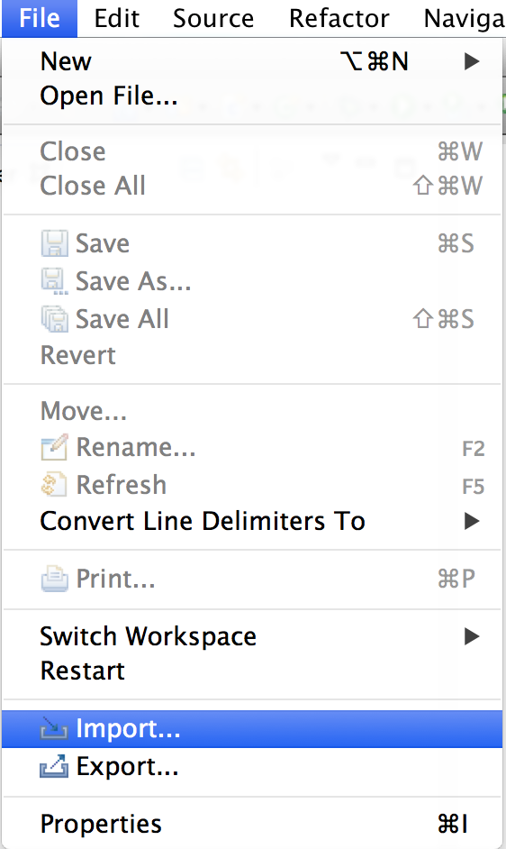
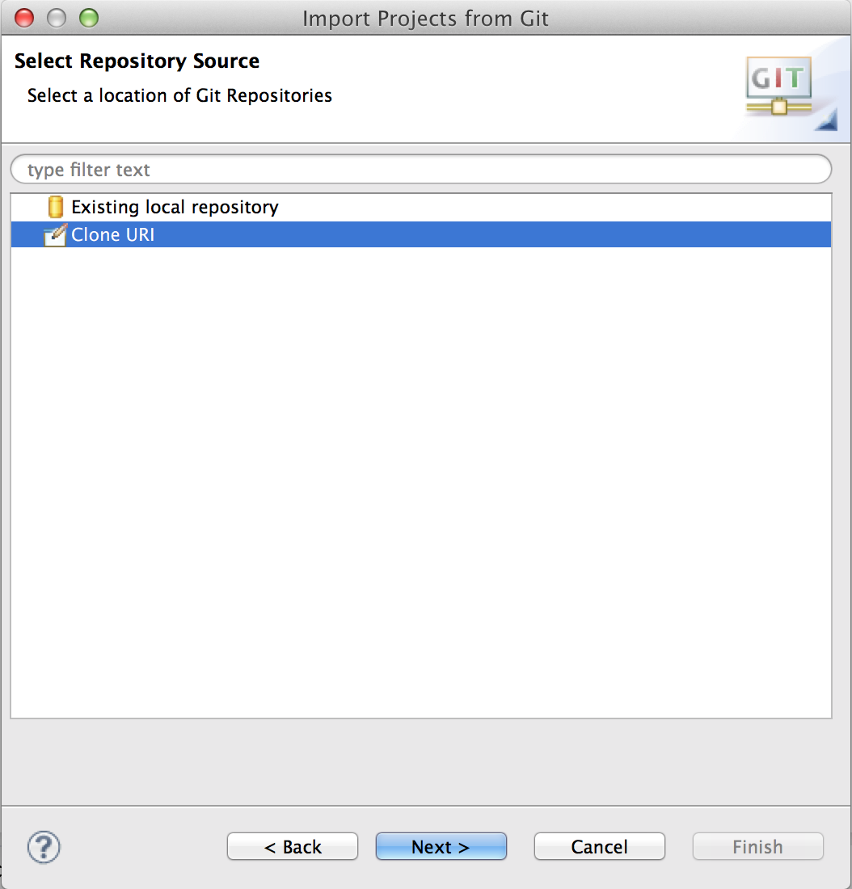
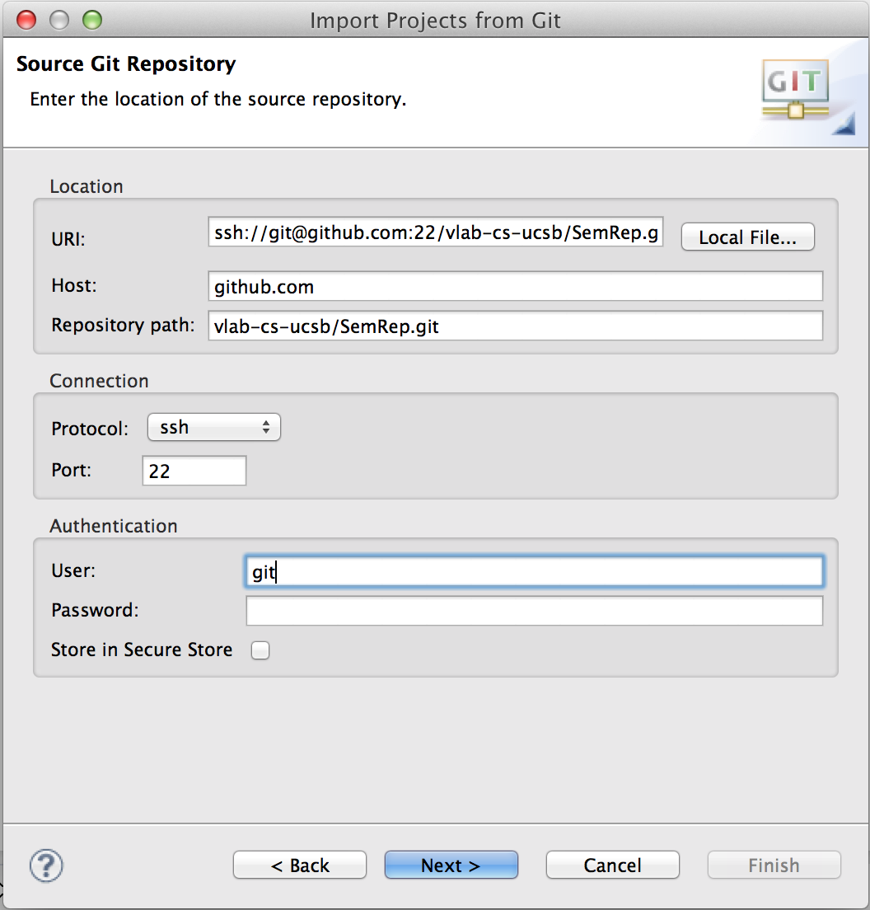
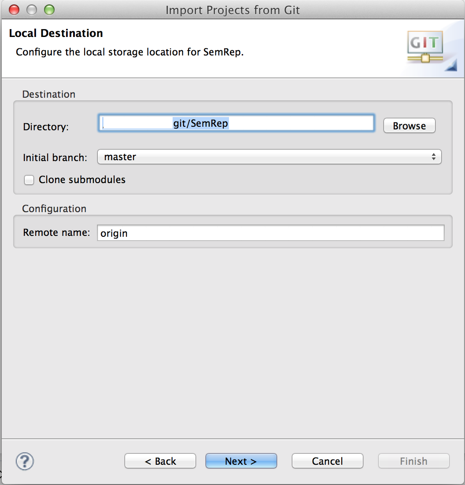
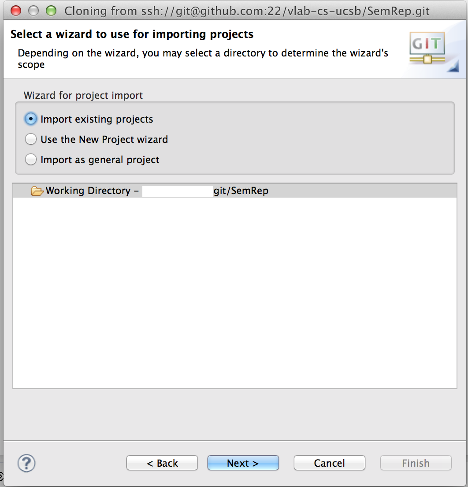
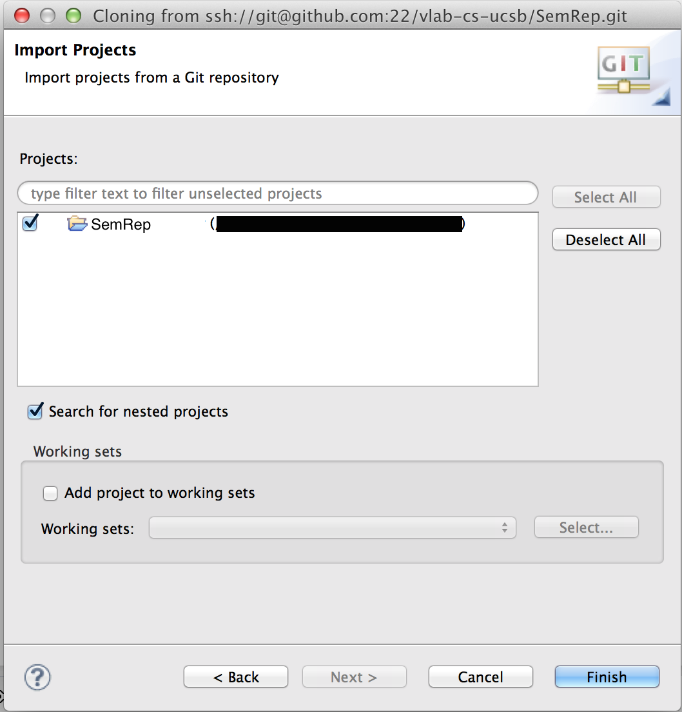

SemRepair
=========
SemRepair is Semantic Differential Repair tool for input validation and sanitization code. The tool analyzes and repairs validation and sanitization functions against each other. The tool does not need any manual specification or intervention. It takes two functions as Dependency Graphs then it looks for differences in validation and sanitization operations for string variables. If a difference is found, the tool suggests a set of three patch functions that can be used to fix the difference.

One application for the tool is to fix differences between a sanitizer function on the client-side and the correponding one on the server. The tool is language agnostic and can be used with Java, PHP or ASP.NET web applications. To achieve this agnosticism, the tool takes sanitizer functions in an intermediate representation that we call Dependency Graph which will be described in details below.

Installation
============
Most of the tool ([SemRep](SemRep)) is written in C++ while the [MinCut](MinCut) algorithm is implemented in Java.
SemRep depends on two c libraries: [LibStranger](https://github.com/vlab-cs-ucsb/LibStranger) and
[MONA library](http://www.brics.dk/mona/index.html). Instructions for compiling and installing the two libraries
can be find on [LibStranger](https://github.com/vlab-cs-ucsb/LibStranger) website.

[SemRep](SemRep) is an Eclipse CDT project. You need to download 
[Eclipse CDT](http://www.eclipse.org/cdt/downloads.php) IDE then import SemRep project from this git repository
into your Eclipse CDT workspace. Here are screenshots on how to do that and for more info go to
[here](http://wiki.eclipse.org/EGit/User_Guide#Starting_from_existing_Git_Repositories). 

After that, use eclipse to build SemRep.

[MinCut](MinCut) is an Eclipse Java project. You need to download 
[Eclipse](http://www.eclipse.org/downloads/) IDE then import MinCut project from this git repository
into your Eclipse workspace as described
[here](http://wiki.eclipse.org/EGit/User_Guide#Starting_from_existing_Git_Repositories). After that, use eclipse to build MinCut.

